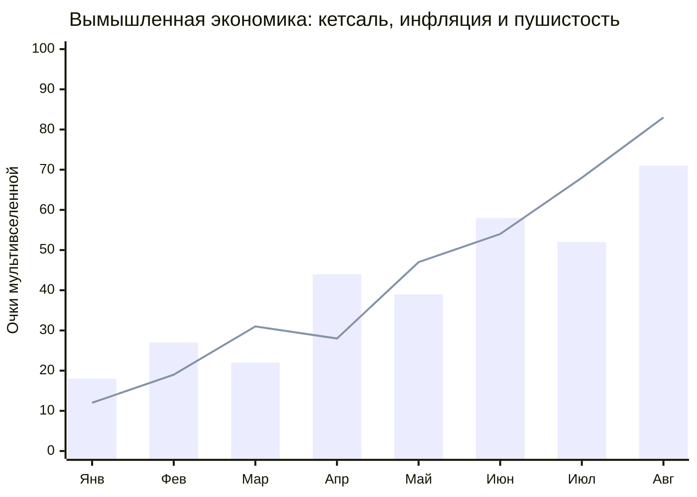

<div align="center">

# 🌈✨ БОЛЬШАЯ КНИГА КРАСИВОЙ ЕРУНДЫ ✨🌈

### 🦜 Атлас гватемальских чисел, облачных пончиков и пушистых котиков 🐈

💚 💛 🧡 ❤️ 💜 💙 🩵 💚 💛 🧡 ❤️ 💜 💙 🩵

**Статистика?** Возможно.  **Наука?** В отпуске.  **Красота?** Уже здесь.

</div>

---

## 🇬🇹 Экономика параллельной Гватемалы

Ниже представлен **абсолютно выдуманный индекс** курса кетсаля, инфляции и котиков на квадратный понедельник. Он не описывает реальные цены, курс валюты или инфляцию — это просто разноцветная диаграмма, которой захотелось пожить в README.



<div align="center">

| 🪙 Показатель | 📈 Январь | 🛸 Август | 🔮 Научный вывод |
|:--|--:|--:|:--|
| Курс кетсаля к облакам | 18 | 71 | Облака стали принимать чаевые |
| Инфляция пончиков | 12 | 83 | Пончики подозрительно круглые |
| Пушистость экономики | 9001 | 9002 | Котик сел на калькулятор |

</div>

> 🧪 Методология: три кубика, лунный свет и один кот, который нажал клавишу «равно».

---

## 🐈 Национальная галерея пушистых котиков

### 1. Плюшевый бухгалтер 🧾

```text
 /\_/\\
( o.o )  «Я пересчитал инфляцию. Она мурчит»
 > ^ <
```

### 2. Котик-облачко ☁️

```text
  /\_____/\\
 /  o   o  \\
|     ^     |   пушистость: 100%
|  \\___//  |
 \\_______//
```

### 3. Великий повелитель пледа 👑

```text
    /\_/\\
  =( ^.^ )=   ✨ МЯУ ✨
    (___)\
```

<div align="center">

## 🧶 Шкала пушистости дня

**Обычный вторник**　░░░░░░░░░░　0 котиков

**Котик увидел коробку**　██████░░░░　6 котиков

**Котик нашёл тёплый ноутбук**　██████████　∞ котиков

### 🐾🐾🐾 МЯУ-ПРОГНОЗ: вечером ожидается локальное выпадение шерсти 🐾🐾🐾

</div>

---

## 🍬 Совершенно ненужные, но прекрасные факты

- 🌋 Вулкан может выглядеть как гора, если смотреть на него издалека и не щуриться.
- 🥑 Авокадо — это настроение, замаскированное под ингредиент.
- 🧦 Потерянный носок, вероятно, основал собственную республику.
- 🐈 Если кот сел на документ, документ официально утверждён.
- 🌈 Радуга — это когда небо включило режим «давай все цвета сразу».

## 🎨 Палитра вселенского великолепия

🟥 **Красный** — срочно искать котика.<br>
🟧 **Оранжевый** — котик найден, он рыжий.<br>
🟨 **Жёлтый** — котик лежит на солнце.<br>
🟩 **Зелёный** — котик одобрил кактус.<br>
🟦 **Голубой** — котик смотрит на аквариум.<br>
🟪 **Фиолетовый** — котик видел сон про лазерную указку.

<div align="center">

# 🌟 КОНЕЦ АТЛАСА. НАЧАЛО МУРЧАНИЯ. 🌟

### 🐈‍⬛ Спасибо за внимание и за бережное отношение к воображаемой экономике 🐈

💚 💛 🧡 ❤️ 💜 💙 🩵 🌈 🩵 💙 💜 ❤️ 🧡 💛 💚

<sub>Все цифры выдуманы. Все котики мысленно поглажены.</sub>

</div>
